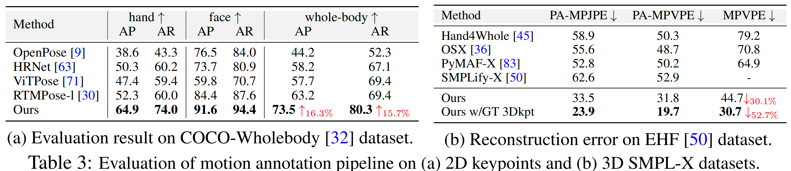
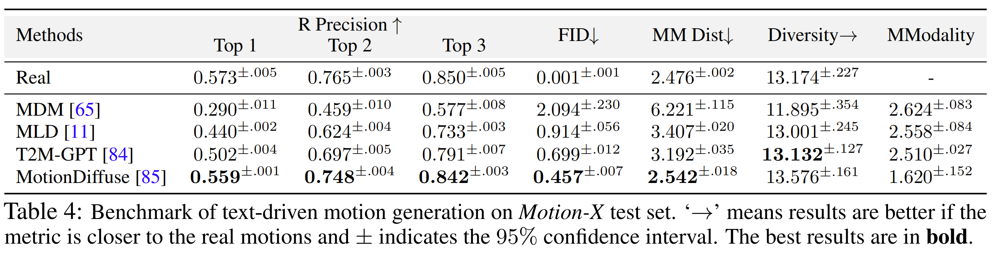
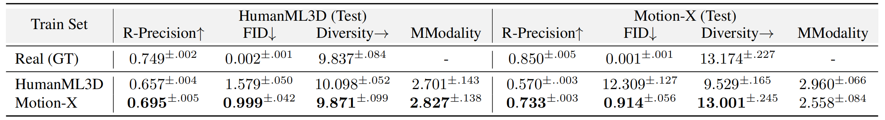
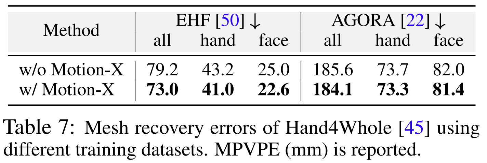

# **Motion-X: A Large-scale 3D Expressive Whole-body Human Motion Dataset**


<p align="center">
  <a href='https://arxiv.org/abs/2307.00818'>
    
  </a>
  <a href='https://arxiv.org/pdf/2307.00818pdf'>
    
  </a>
  <a href='https://motion-x-dataset.github.io'>
  </a>
  <a href='https://youtu.be/0a0ZYJgzdWE'>
  </a>
  <a href='https://github.com/IDEA-Research/Motion-X'>
    </a>
  <a href='LICENSE'>
    
  </a>
  <a href="" target='_blank'>
    
  </a>
</p>

This repository contains the implementation of the following paper:
> Motion-X: A Large-scale 3D Expressive Whole-body Human Motion Dataset <br>[Jing Lin](https://jinglin7.github.io/)<sup>😎12</sup>, [Ailing Zeng](https://ailingzeng.site/)<sup>😎🤗1</sup>, [Shunlin Lu](https://shunlinlu.github.io/)<sup>😎13</sup>, [Yuanhao Cai](https://github.com/caiyuanhao1998)<sup>2</sup>, [Ruimao Zhang](http://www.zhangruimao.site/)<sup>3</sup>, [Haoqian Wang](https://www.sigs.tsinghua.edu.cn/whq_en/main.htm)<sup>2</sup>, [Lei Zhang](https://www.leizhang.org/)<sup>1</sup><br>
> <sup>😎</sup>Equal contribution. <sup>🤗</sup>Corresponing author.<sup>
> 
><sup>1</sup>International Digital Economy Academy <sup>2</sup>Tsinghua University <sup>3</sup>The Chinese University of Hong Kong, Shenzhen<sup>

## 🥳 News
- [2024.1.9] We update the frame-level textual descriptions for each whole-body pose. Please download it [here](https://drive.google.com/file/d/168ja-oBTHM0QDKFIcRriQFPew5gUlZkQ/view?usp=sharing) and refer to this usage guidance [here](https://github.com/IDEA-Research/Motion-X/blob/main/PoseText/PoseText_README.md).
- [2023.12.22] We update the sequential motion text descriptions (text_v1.1) augmented by [Vicuna 1.5](https://lmsys.org/blog/2023-03-30-vicuna/) to enhance the standardization and diversity of text. Please download via [this link](https://drive.google.com/file/d/1DecnWjxM7d2uQKaHk_u5QQRALlNle_q_/view?usp=sharing) and replace it with the original file **motionx_seq_text.zip**. Many thanks to [Linghao Chen](https://lhchen.top) for polishing the text labels!
- [2023.11.15] We release the rendered SMPL-X visualization of all subsets on [DDS](https://deepdataspace.com/dataset/motionx/home) platform for quick content viewing.
- [2023.11.15] We release the [HumanTOMATO](https://github.com/IDEA-Research/HumanTOMATO/tree/main) motion representation (`tomato` representation) and split files.
- [2023.10.26] We release the Motion-X-V1, which provides semantic text labels corresponding to SMPL-X sequences, facial expression motions, and the corresponding texts for augmenting some motions without facial expressions. Please kindly check your email!
- [2023.10.26] We release a high-quality monocular dataset named IDEA400 as a subset of Motion-X, which contains rich expressions and gestures. See this [video](https://www.youtube.com/watch?v=QWoll6asFhE) for more details.

## 📜 TODO
- [x] Release whole-body pose descriptions.
- [ ] Gathering more motion datasets (e.g., music-to-dance, audio-to-gesture motions).
- [ ] Release Videos after the agreement of video owners.
- [ ] Release audio and music if motions are needed.
      
**Stay tuned!**

## 🥳 Highlight Motion Samples


**📊 Table of Contents**

  1. [General Description](#general-description)
  2. [Dataset Download](#dataset-download)
  3. [Experiments](#experiments)
  4. [Citing](#citing)

## 📜 General Description

We propose a high-accuracy and efficient annotation pipeline for whole-body motions and the corresponding text labels. Based on it, we build a large-scale 3D expressive whole-body human motion dataset from massive online videos and eight existing motion datasets. We unify them into the same formats, providing whole-body motion (i.e., SMPL-X) and corresponding text labels.

**Labels from Motion-X:** 

- Motion label: including `15.6M` whole-body poses and `81.1K` motion clips annotation, represented as SMPL-X parameters. All motions have been unified in 30 fps.
- Text label: (1) `15.6M` frame-level whole-body pose description and (2) `81.1K` sequence-level semantic labels.
- Other modalities: RGB videos, audio, and music information.

**Supported Tasks:**

- Text-driven 3d whole-body human motion generation
- 3D whole-body human mesh recovery
- Others: Motion pretraining, multi-modality pre-trained models for motion understanding and generation, etc.

<div align="center">
<table cellspacing="0" cellpadding="0" bgcolor="#ffffff" border="0">
  <tr>
    <th align="center">Dataset</th>
    <th align="center">Clip Number</th>
    <th align="center">Frame Number</th>
    <th align="center">Website</th>
    <th align="center">License</th>
    <th align="center">Downloading Link</th>
  </tr>
  <tr></tr>
  <tr>
    <td align="center"><b>AMASS</b></td>
    <td align="center">26K</td>
    <td align="center">5.4M</td>
    <td align="center"><a href="https://amass.is.tue.mpg.de/" target="_blank">AMASS<br>Website</a></td>
    <td align="center"><a href="https://amass.is.tue.mpg.de/license.html" target="_blank">AMASS<br>License</a></td>
    <td align="center"><a href="https://amass.is.tue.mpg.de/login.php" target="_blank">AMASS Data</a></td>
  </tr>
  <tr></tr>
  <tr>
    <td align="center"><b>EgoBody</b></td>
    <td align="center">1.0K</td>
    <td align="center">0.4M</td>
    <td align="center"><a href="https://sanweiliti.github.io/egobody/egobody.html" target="_blank">EgoBody<br>Website</a></td>
    <td align="center"><a href="https://egobody.ethz.ch/" target="_blank">EgoBody<br>License</a></td>
    <td align="center"><a href="https://egobody.ethz.ch/" target="_blank">EgoBody Data</a></td>
  </tr>
  <tr></tr>
  <tr>
    <td align="center"><b>GRAB</b></td>
    <td align="center">1.3K</td>
    <td align="center">0.4M</td>
    <td align="center"><a href="https://grab.is.tue.mpg.de/" target="_blank">GRAB<br>Website</a></td>
    <td align="center"><a href="https://grab.is.tue.mpg.de/license.html" target="_blank">GRAB<br>License</a></td>
    <td align="center"><a href="https://grab.is.tue.mpg.de/login.php" target="_blank">GRAB Data</a></td>
  </tr>
  <tr></tr>
  <tr>
    <td align="center"><b>IDEA400</b></td>
    <td align="center">12.5K</td>
    <td align="center">2.6M</td>
    <td align="center"><a href="https://motion-x-dataset.github.io/" target="_blank">IDEA400<br>Website</a>
    <td align="center"><a href="https://docs.google.com/document/d/1xeNQkkxD39Yi6pAtJrFS1UcZ2LyJ6RBwxicwQ2j3-Vs" target="_blank">IDEA400 License</a></td>
    <td align="center"><a href="https://docs.google.com/forms/d/e/1FAIpQLSeb1DwnzGPxXWWjXr8cLFPAYd3ZHlWUtRDAzYoGvAKmS4uBlA/viewform" target="_blank">IDEA400 Data</a>
  </td>
  </tr>
  <tr></tr>
  <tr>
    <td align="center"><b>AIST++</b></td>
    <td align="center">1.4K</td>
    <td align="center">0.3M</td>
    <td align="center"><a href="https://google.github.io/aistplusplus_dataset/" target="_blank">AIST++ <br>Website</a></td>
    <td align="center"><a href="https://google.github.io/aistplusplus_dataset/factsfigures.html" target="_blank">AIST++<br>License</a></td>
    <td align="center"><a href="https://docs.google.com/forms/d/e/1FAIpQLSeb1DwnzGPxXWWjXr8cLFPAYd3ZHlWUtRDAzYoGvAKmS4uBlA/viewform" target="_blank">AIST++ Data</a>
  </tr>
  <tr></tr>
  <tr>
    <td align="center"><b>HAA500</b></td>
    <td align="center">5.2K</td>
    <td align="center">0.3M</td>
    <td align="center"><a href="https://www.cse.ust.hk/haa/" target="_blank">HAA500<br>Website</a></td>
    <td align="center"><a href="https://www.cse.ust.hk/haa/index.html" target="_blank">HAA500<br>License</a></td>
    <td align="center"><a href="https://docs.google.com/forms/d/e/1FAIpQLSeb1DwnzGPxXWWjXr8cLFPAYd3ZHlWUtRDAzYoGvAKmS4uBlA/viewform" target="_blank">HAA500 Data</a>
  </tr>
  <tr></tr>
  <tr>
    <td align="center"><b>HuMMan</b></td>
    <td align="center">0.7K</td>
    <td align="center">0.1M</td>
    <td align="center"><a href="https://caizhongang.github.io/projects/HuMMan/" target="_blank">HuMMan<br>Website</a></td>
    <td align="center"><a href="https://caizhongang.github.io/projects/HuMMan/license.txt" target="_blank">HuMMan<br>License</a></td>
    <td align="center"><a href="https://docs.google.com/forms/d/e/1FAIpQLSeb1DwnzGPxXWWjXr8cLFPAYd3ZHlWUtRDAzYoGvAKmS4uBlA/viewform" target="_blank">HuMMan Data</a>
     </tr>
  <tr></tr>
  <tr>
    <td align="center"><b>BAUM</b></td>
    <td align="center">1.4K</td>
    <td align="center">0.2M</td>
    <td align="center"><a href="https://mimoza.marmara.edu.tr/~cigdem.erdem/BAUM1/" target="_blank">BAUM<br>Website</a>
    <td align="center"><a href="https://mimoza.marmara.edu.tr/~cigdem.erdem/BAUM1/" target="_blank">BAUM<br>License</a></td>
    <td align="center"><a href="https://docs.google.com/forms/d/e/1FAIpQLSeb1DwnzGPxXWWjXr8cLFPAYd3ZHlWUtRDAzYoGvAKmS4uBlA/viewform" target="_blank">BAUM Data</a>
</td>
  </tr>
  <tr></tr>
  <tr>
    <td align="center"><b>Online Videos</b></td>
    <td align="center">32.5K</td>
    <td align="center">6.0M</td>
    <td align="center">---</td>
    <td align="center">---</a></td>
    <td align="center"><a href="https://docs.google.com/forms/d/e/1FAIpQLSeb1DwnzGPxXWWjXr8cLFPAYd3ZHlWUtRDAzYoGvAKmS4uBlA/viewform" target="_blank">Online Data</a>
  </tr>
  <tr></tr>
  <tr></tr>
  <tr style="background-color: lightgray;">
    <td align="center"><b>Motion-X (Ours)</b></td>
    <td align="center">81.1K</td>
    <td align="center">15.6M</td>
    <td align="center"><a href="https://motion-x-dataset.github.io/" target="_blank">Motion-X Website</a></td>
    <td align="center"><a href="https://motion-x-dataset.github.io/static/license/Motion-X%20License.pdf" target="_blank">Motion-X License</a></td>
    <td align="center"><a href="https://docs.google.com/forms/d/e/1FAIpQLSeb1DwnzGPxXWWjXr8cLFPAYd3ZHlWUtRDAzYoGvAKmS4uBlA/viewform" target="_blank">Motion-X Data</a>
  </tr>
</table>
</div>


## 📥 Dataset Download

We disseminate Motion-X in a manner that aligns with the original data sources. Here are the instructions:

### 1. Request Authorization

Please fill out [this form](https://docs.google.com/forms/d/e/1FAIpQLSeb1DwnzGPxXWWjXr8cLFPAYd3ZHlWUtRDAzYoGvAKmS4uBlA/viewform) to request authorization to use Motion-X for non-commercial purposes. Then you will receive an email and please download the motion and text labels from the provided downloading links. The pose texts can be downloaded from [here](https://drive.google.com/file/d/168ja-oBTHM0QDKFIcRriQFPew5gUlZkQ/view?usp=sharing). Please extract the body_texts folder and hand_texts folder from the downloaded motionx_pose_text.zip.（Note: We updated the Baidu Disk link of motionx_seq_face_text.zip and motionx_face_motion.zip on October 29, 2023. Thus, if you download these zips via Baidu Disk before October 29, please fill out [the form](https://docs.google.com/forms/d/e/1FAIpQLSeb1DwnzGPxXWWjXr8cLFPAYd3ZHlWUtRDAzYoGvAKmS4uBlA/viewform) and download again.）


<summary>Please collect them as the following directory structure: </summary>

```
../datasets  

├──  motion_data
  ├── smplx_322
    ├── idea400
    ├── ...
├──  face_motion_data
  ├── smplx_322
    ├── humanml
    ├── EgoBody
    ├── GRAB
├── texts
  ├──  semantic_labels
    ├── idea400
    ├── ...
  ├──  face_texts
    ├── humanml
    ├── EgoBody
    ├── GRAB
    ├── idea400
    ├── ...
  ├──  body_texts
    ├── humanml
    ├── EgoBody
    ├── GRAB
    ├── idea400
    ├── ...
  ├──  hand_texts
    ├── humanml
    ├── EgoBody
    ├── GRAB
    ├── idea400
    ├── ...
```


### 2. Non-Mocap Subsets

For the non-mocap subsets, please refer to [this link](https://github.com/IDEA-Research/Motion-X/tree/main/non-mocap-dataset-process) for a detailed instruction, notably:

- We do not distribute the original RGB videos. We provide the motion and text labels annotated by our team.
- Due to license and quality consideration, we do not provide NTU-RGBD120. Instead, we build IDEA400, which includes 400 daily actions (covering NTU-RGBD120). Please refer to this [video](https://www.youtube.com/watch?v=QWoll6asFhE) for a detailed introduction. 

### 3. Mocap Subsets  

For the mocap datasets (i.e., AMASS, GRAB, EgoBody), please refer to [this link](https://github.com/IDEA-Research/Motion-X/tree/main/mocap-dataset-process) for a detailed instruction, notably:

- We do not distribute the original motion data. 
- We only provide the text labels and facial expressions annotated by our team. 

The AMASS and GRAB datasets are released for academic research under custom licenses by Max Planck Institute for Intelligent Systems. To download AMASS and GRAB, you must register as a user on the dataset websites and agree to the terms and conditions of each license:

https://amass.is.tue.mpg.de/license.html

https://grab.is.tuebingen.mpg.de/license.html


<summary>Finally, the datasets folder is collected as the following directory structure:</summary>


```  
../datasets  

├──  motion_data
  ├── smplx_322
    ├── humanml
    ├── EgoBody
    ├── GRAB
    ├── idea400
    ├── ...
├── texts
  ├──  semantic_labels
    ├── idea400
    ├── ...
  ├──  face_texts
    ├── humanml
    ├── EgoBody
    ├── GRAB
    ├── idea400
    ├── ...
  ├──  body_texts
    ├── humanml
    ├── EgoBody
    ├── GRAB
    ├── idea400
    ├── ...
  ├──  hand_texts
    ├── humanml
    ├── EgoBody
    ├── GRAB
    ├── idea400
    ├── ...
```


## 🚀  Data Loading 


* To load the motion and text labels you can simply do:

  ```python
  import numpy as np
  import torch
  
  # read motion and save as smplx representation
  motion = np.load('motion_data/smplx_322/000001.npy')
  motion = torch.tensor(motion).float()
  motion_parms = {
              'root_orient': motion[:, :3],  # controls the global root orientation
              'pose_body': motion[:, 3:3+63],  # controls the body
              'pose_hand': motion[:, 66:66+90],  # controls the finger articulation
              'pose_jaw': motion[:, 66+90:66+93],  # controls the yaw pose
              'face_expr': motion[:, 159:159+50],  # controls the face expression
              'face_shape': motion[:, 209:209+100],  # controls the face shape
              'trans': motion[:, 309:309+3],  # controls the global body position
              'betas': motion[:, 312:],  # controls the body shape. Body shape is static
          }
  
  # read text labels
  semantic_text = np.loadtxt('semantic_labels/000001.npy')     # semantic labels 
  ```

## 💻 Experiments  
#### Validation of the motion annotation pipeline

Our annotation pipeline significantly surpasses existing SOTA 2D whole-body models and mesh recovery methods.
<p align="middle">

<br>
</p>

#### Benchmarking Text-driven Whole-body Human Motion Generation

<p align="middle">

<br>
</p>

#### Comparison with HumanML3D on Whole-body Human Motion Generation Task

<p align="middle">

<br>
</p>

#### Impact on 3D Whole-Body Human Mesh Recovery

<p align="middle">

<br>
</p>

## 🤝 Citation  

If you find this repository useful for your work, please consider citing it as follows:

```  
@article{lin2023motionx,
  title={Motion-X: A Large-scale 3D Expressive Whole-body Human Motion Dataset},
  author={Lin, Jing and Zeng, Ailing and Lu, Shunlin and Cai, Yuanhao and Zhang, Ruimao and Wang, Haoqian and Zhang, Lei},
  journal={Advances in Neural Information Processing Systems},
  year={2023}
}
```
